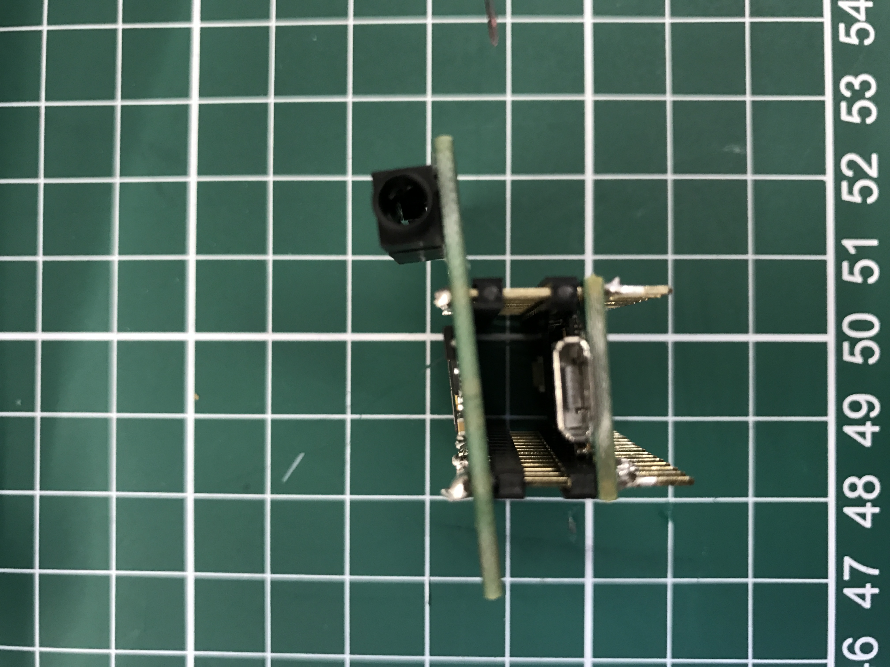
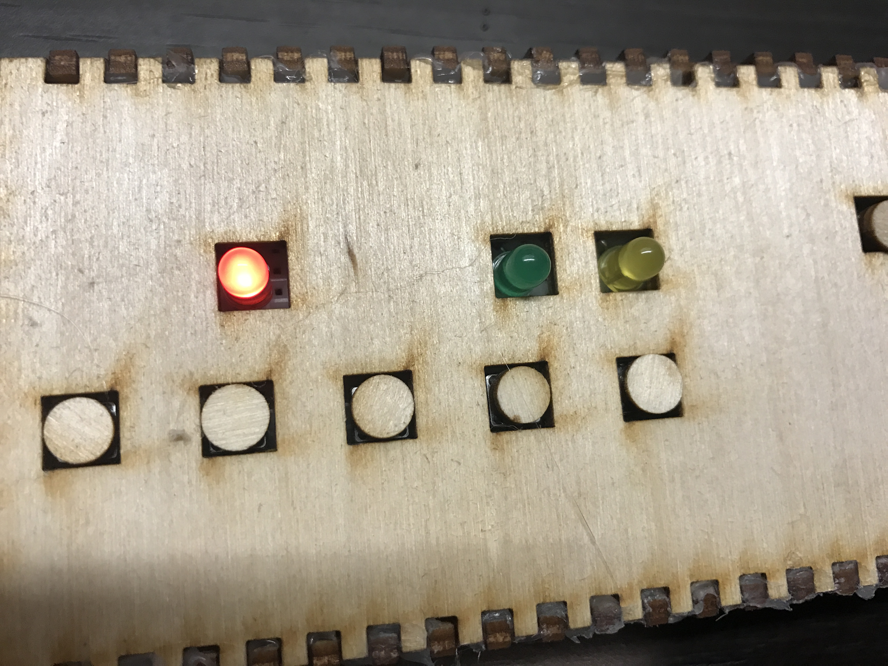

# TeenLooper


## Premise
**RC-505(Loop Station)**
[RC-505](https://www.boss.info/global/products/rc-505/ "Title") 


*RC-505*

Basically, it is an instrument that has the power to record sounds in 5 tracks, and playback each of them seperatly. It also has built-in effects for a variety of creation.

## Goal
The goal for this project is to create a basic loop station using Teensy and its audio adapter.

**List**

1.At least 1 track of recording

2.Playback audios from Micro SD card

3.Use buttons for control

4.LEDs show the states for each button

## Component
**Hardware**

Teensy 3.2: PC board

Teensy Audio Adaptor: CD quality audio with Teensy

MicroSD card: Store .wav and raw(record) files 

14x1 Pins(double insulator): Solder Teensy and audio board

Buttons, LEDs, Wires, Resistors

830 point Breadboard

**Sorfware**

[Arduino library(Teensyduino)](https://www.pjrc.com/teensy/teensyduino.html "Title") 

[Teensy Audio Library](https://www.pjrc.com/teensy/td_libs_Audio.html "Title") 

## Steps
**STEP 1**

**Solder boards**

Using 14x1 Pins(double insulator or 1 male + 1 female) to connect Teensy 3.2 and Audio Adapter


*Solder sideview*

*Solder Topview*

**STEP 2**

**Install on breadboard**

**Buttons:**

"Sound" 1,2,3 connect to digital pin 0,1,2

"Sound switch" connects to digital pin 17

"Play" connects to digital pin 5

"Record" connects to digital pin 8

**LEDs:** signal for button status

"Sound switch" connects to digital pin 15

"Play" connects to digital pin 21

"Record" connects to digital pin 20


*Wire Connections*

**STEP 3**

**Play music from Micro SD card**

Now we need to test if we can play wav. from the SD card so we can make sounds when pressing buttons.

Put any wav. file(16 bit, 44.1 kHz sample rate) to SD card and name it "HiHatt.WAV"(for the code we are using)

Then, press the second "sound button" to see if the music is coming out.

In the script "Instrument", 6 sounds are available. Pressing button "Sound Switch" can trigger other 3 sounds and the first LED will light up.


*Sound Switch*

**STEP 4**

**Recording & Playing**

The final feature to implement is recording and playingback. 

The record file will be stored in the SD card as "RECORD.RAW". Everytime pressing button "Record", the file will be override.

In the script, you can find the main recoring function "continueRecording" that write the data to the temporary buffer, and "stopRecording" that write the data to the file.

```
void continueRecording() {
  if (queue1.available() >= 2) {
    byte buffer[512];
    // Fetch 2 blocks from the audio library and copy
    // into a 512 byte buffer.  The Arduino SD library
    // is most efficient when full 512 byte sector size
    // writes are used.
    memcpy(buffer, queue1.readBuffer(), 256);
    queue1.freeBuffer();
    memcpy(buffer+256, queue1.readBuffer(), 256);
    queue1.freeBuffer();
    // write all 512 bytes to the SD card
    elapsedMicros usec = 0;
    f1.write(buffer, 512);
  }
}

void stopRecording() {
  Serial.println("stopRecording");
  queue1.end();
  if (mode == 1) {
    while (queue1.available() > 0) {
      f1.write((byte*)queue1.readBuffer(), 256);
      queue1.freeBuffer();
    }
    f1.close();
  }
  digitalWrite(ledRecord_Pin,LOW);
  mode = 0;
}
```
 
*Recording*
 
*Playing record*


**STEP 5**

**Play it !!!**


[TeenLooper video](https://youtu.be/9EvYHcrmF0I
 "Title")
 
 
**STEP 6**

**Enclosure**

Design the box in Illustrator and use laser cutting on wood to make a box.


*Box design*


*Wood enclosure*

**Future** 

The feature of recording human voice will be implement in the future.

Find a microphone with good quality of recording ability and connect it to the "Mic" pin on the Teensy audio adaptor.

